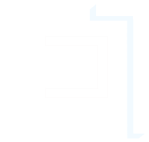

<!-- PROJECT SHIELDS -->
<!--
*** I'm using markdown "reference style" links for readability.
*** Reference links are enclosed in brackets [ ] instead of parentheses ( ).
*** See the bottom of this document for the declaration of the reference variables
*** for contributors-url, forks-url, etc. This is an optional, concise syntax you may use.
*** https://www.markdownguide.org/basic-syntax/#reference-style-links
-->
[![Contributors][contributors-shield]][contributors-url]
[![Forks][forks-shield]][forks-url]
[![Stargazers][stars-shield]][stars-url]
[![Issues][issues-shield]][issues-url]
[![MIT License][license-shield]][license-url]
[![X.com][twitter-shield]][twitter-url]

<!-- PROJECT LOGO -->
 

  <a href="https://github.com/0xphoton/threecapxyz">
  <picture>
    <source media="(prefers-color-scheme: dark)" srcset="assets/threecap-dark-logo.svg">
    <source media="(prefers-color-scheme: light)" srcset="assets/threecap-light-logo.svg">
    
  </picture>
  </a>
  <h1 align="center">THREECAP</h1>
  <picture>
    <source media="(prefers-color-scheme: dark)" srcset="assets/3CAP-dark.svg">
    <source media="(prefers-color-scheme: light)" srcset="assets/3CAP-light.svg">
    
  </picture>
  <h3 align="center">Web3 Knowledge Base<h3>

  

    

    <a>IN PROGRESS....</a>
    <a href="https://github.com/0xphoton/threecapxyz"><strong>Explore the docs »</strong></a>
     
     
    <a href="https://github.com/0xphoton/threecapxyz">View Demo</a>
    ·
    <a href="https://github.com/0xphoton/threecapxyz/issues/new?labels=bug&template=bug-report---.md">Report Bug</a>
    ·
    <a href="https://github.com/0xphoton/threecapxyz/issues/new?labels=enhancement&template=feature-request---.md">Request Feature</a>
  

<!-- TABLE OF CONTENTS -->

  
Table of Contents

  <ol>
    <li>
      <a href="#about-the-project">About The Project</a>
      <ul>
        <li><a href="#built-with">Built With</a></li>
      </ul>
    </li>
    <li>
      <a href="#getting-started">Getting Started</a>
      <ul>
        <li><a href="#prerequisites">Prerequisites</a></li>
        <li><a href="#installation">Installation</a></li>
      </ul>
    </li>
    <li><a href="#usage">Usage</a></li>
    <li><a href="#roadmap">Roadmap</a></li>
    <li><a href="#contributing">Contributing</a></li>
    <li><a href="#license">License</a></li>
    <li><a href="#contact">Contact</a></li>
    <li><a href="#acknowledgments">Acknowledgments</a></li>
  </ol>

<!-- ABOUT THE PROJECT -->
## About The Project

[![Product Name Screen Shot][product-screenshot]](https://example.com)

With the fast pace of the web3 space, staying informed about news, events, and market movements can be overwhelming. Threecap is here to simplify that by gathering web3 information from multiple sources and summarizing it using an advanced AI. This allows users to quickly digest the most important updates in bite-sized pieces. Additionally, users can chat with the Threecap agent to dive deeper into specific events or discuss web3 topics to gain a better understanding of complex concepts.

(<a href="#readme-top">back to top</a>)

### Built With

Threecap is built using various technologies.

* [![Python][python.py]][python-url]
* [![Flask][flask.py]][flask-url]

(<a href="#readme-top">back to top</a>)

<!-- GETTING STARTED -->
## Getting Started

IN PROGRESS

(<a href="#readme-top">back to top</a>)

<!-- ROADMAP -->
## Roadmap

IN PROGRESS

(<a href="#readme-top">back to top</a>)

<!-- CONTRIBUTING -->
## Contributing

Contributions are what make the open source community such an amazing place to learn, inspire, and create. Any contributions you make are **greatly appreciated**.

If you have a suggestion that would make this better, please fork the repo and create a pull request. You can also simply open an issue with the tag "enhancement".
Don't forget to give the project a star! Thanks again!

1. Fork the Project
2. Create your Feature Branch (`git checkout -b feature/AmazingFeature`)
3. Commit your Changes (`git commit -m 'Add some AmazingFeature'`)
4. Push to the Branch (`git push origin feature/AmazingFeature`)
5. Open a Pull Request

<!-- LICENSE -->
## License

Distributed under the MIT License. See `LICENSE.txt` for more information.

(<a href="#readme-top">back to top</a>)

<!-- CONTACT -->
## Contact

Say hello 👋
- 0xphoton - [@0xphoton](https://x.com/0xphoton) 
- hello@threecap.xyz

#### Project Link: [https://github.com/0xphoton/threecapxyz](https://github.com/0xphoton/threecapxyz)

(<a href="#readme-top">back to top</a>)

<!-- ACKNOWLEDGMENTS -->
## Acknowledgments

Credits to:

* [Choose an Open Source License](https://choosealicense.com)
* [Best README Template by otheneildrew ](https://github.com/othneildrew/Best-README-Template/)

(<a href="#readme-top">back to top</a>)

<!-- MARKDOWN LINKS & IMAGES -->
<!-- https://www.markdownguide.org/basic-syntax/#reference-style-links -->
[contributors-shield]: https://img.shields.io/github/contributors/0xphoton/threecapxyz.svg?style=for-the-badge
[contributors-url]: https://github.com/0xphoton/threecapxyz/graphs/contributors
[forks-shield]: https://img.shields.io/github/forks/0xphoton/threecapxyz.svg?style=for-the-badge
[forks-url]: https://github.com/0xphoton/threecapxyz/network/members
[stars-shield]: https://img.shields.io/github/stars/0xphoton/threecapxyz.svg?style=for-the-badge
[stars-url]: https://github.com/0xphoton/threecapxyz/stargazers
[issues-shield]: https://img.shields.io/github/issues/0xphoton/threecapxyz.svg?style=for-the-badge
[issues-url]: https://github.com/0xphoton/threecapxyz/issues
[license-shield]: https://img.shields.io/github/license/0xphoton/threecapxyz.svg?style=for-the-badge
[license-url]: https://github.com/0xphoton/threecapxyz/blob/master/LICENSE.txt
[twitter-shield]: https://img.shields.io/badge/X.COM-1DA1F2?style=for-the-badge&logo=x&logoColor=black
[twitter-url]: https://x.com/threecapxyz
[product-screenshot]: images/screenshot.png
[python.py]: https://img.shields.io/badge/Python-14354C?style=for-the-badge&logo=python&logoColor=white
[python-url]: https://python.org
[flask.py]: https://img.shields.io/badge/Flask-000000?style=for-the-badge&logo=flask&logoColor=white
[flask-url]: https://flask.palletsprojects.com/
